深度学习环境搭建与手写数字识别全流程指南
适用：零基础同学，从连接服务器到训练出模型并预测
环境：本地 Windows/Mac 笔记本 + 远程 Linux 工作站
文档中配上了一些图片，便于零基础的同学更直观地学习

第一部分：基础技能——远程连接、Docker、Git
在开始项目之前，请确保已掌握以下三项基本技能。

1. VSCode + SSH 远程连接工作站
1.1 安装 VSCode 与 Remote-SSH 扩展
下载安装 VSCode

在扩展商店搜索 Remote - SSH (Microsoft) 并安装
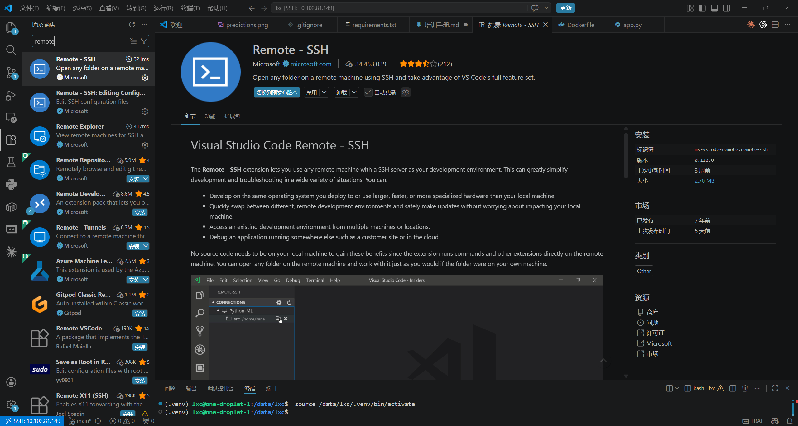
1.2 添加 SSH 连接
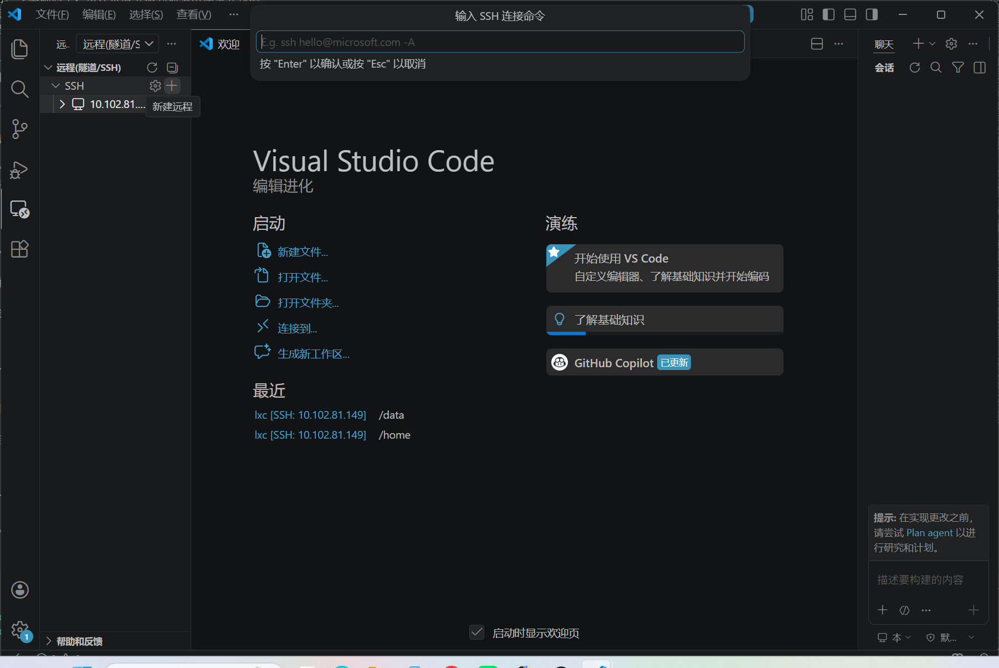

输入 ssh lxc@10.102.81.149（替换为实际用户名和IP）

选择保存配置文件的路径（默认即可）

连接成功后，VSCode 左下角显示 SSH: 10.102.81.149

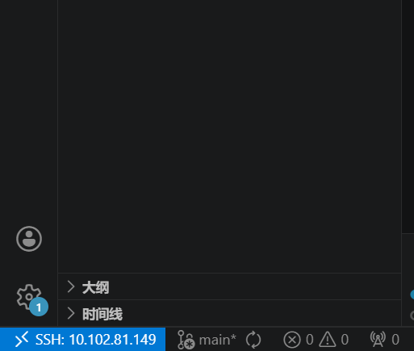

1.3 打开远程文件夹
左侧资源管理器 → 打开文件夹 → 输入 /data/lxc（或你的工作目录）
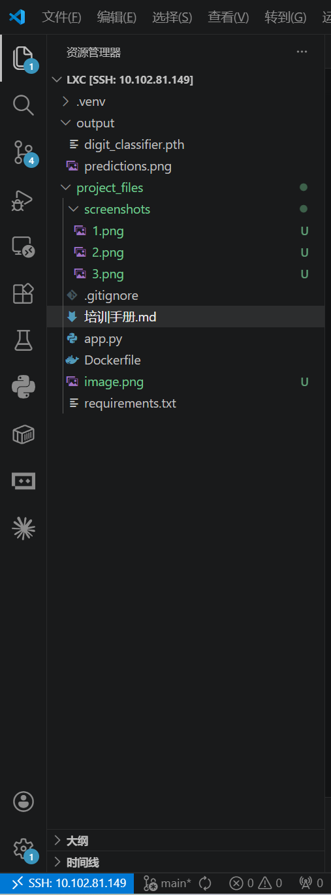

1.4 安装必要的远程扩展
在扩展商店中安装以下扩展，并注意选择 “在 SSH: xxx 中安装”：

Python (Microsoft)
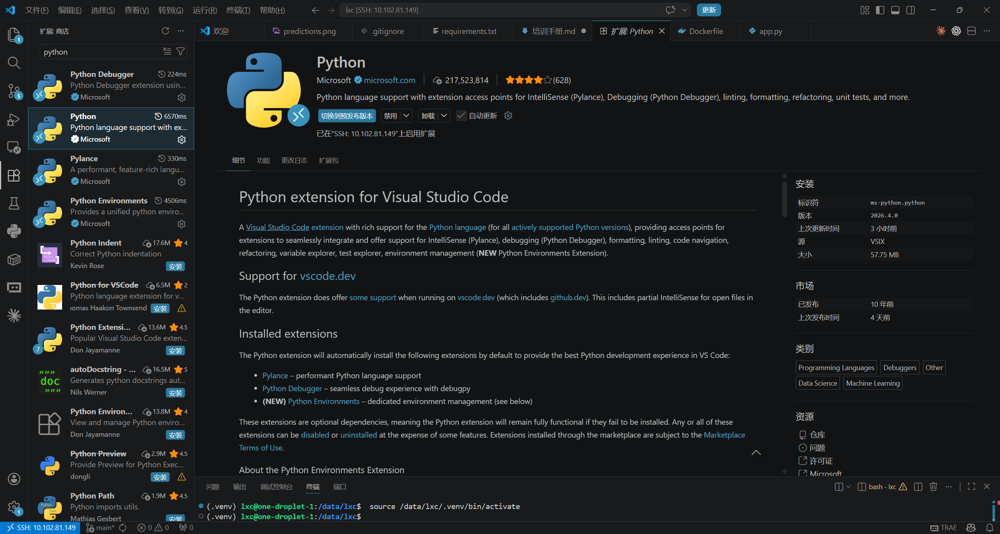
Docker (Microsoft)
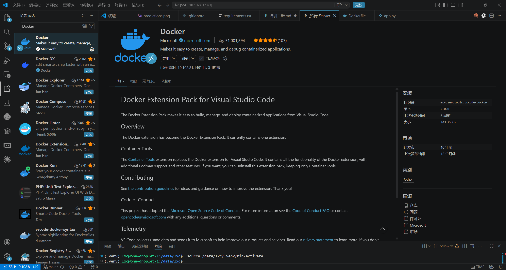
Containers Tools (Microsoft) 
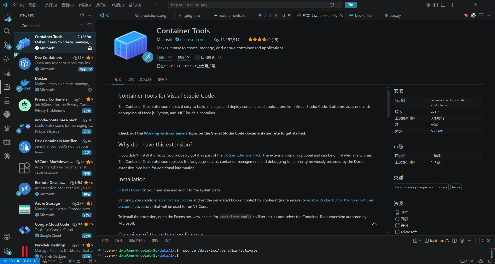

安装完成后，重新加载窗口（Ctrl+Shift+P → Developer: Reload Window）

2. Docker 环境搭建与容器运行
2.1 核心概念
镜像：环境的模板（只读）

容器：镜像的运行实例，相互隔离

Dockerfile：构建镜像的指令文件
在进行下列步骤之前请保证你已经写好了dockerfile（镜像），requirements.txt（依赖）以及app.py（应用）
上述三个文件内容具体怎么写请交给ai编程助手

2.2 构建镜像
docker build -t digit-app .
-t digit-app：镜像命名为 digit-app

.：使用当前目录下的 Dockerfile

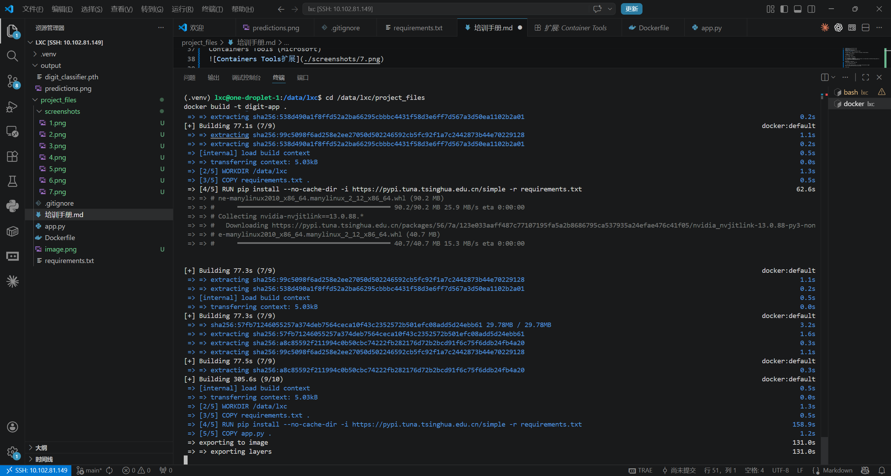
2.3 运行容器
# 前台交互运行，退出后自动删除
docker run -it --rm digit-app

# 后台运行并挂载目录
docker run -d -v /data/output:/app/output digit-app
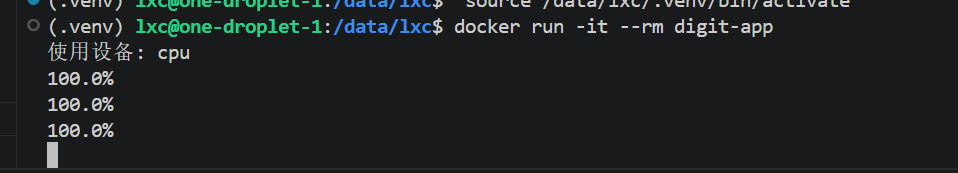

2.4 常用 Docker 命令
命令	说明
docker ps	查看运行中的容器
docker ps -a	查看所有容器
docker images	查看本地镜像
docker stop 容器名	停止容器
docker rm 容器名	删除容器
docker exec -it 容器名 /bin/bash	进入容器内部
3. Git 版本控制与 GitHub 推送
3.1 配置 Git 身份
git config --global user.name "你的姓名"（github注册之后的用户名）
git config --global user.email "你的邮箱"（github注册用的邮箱）
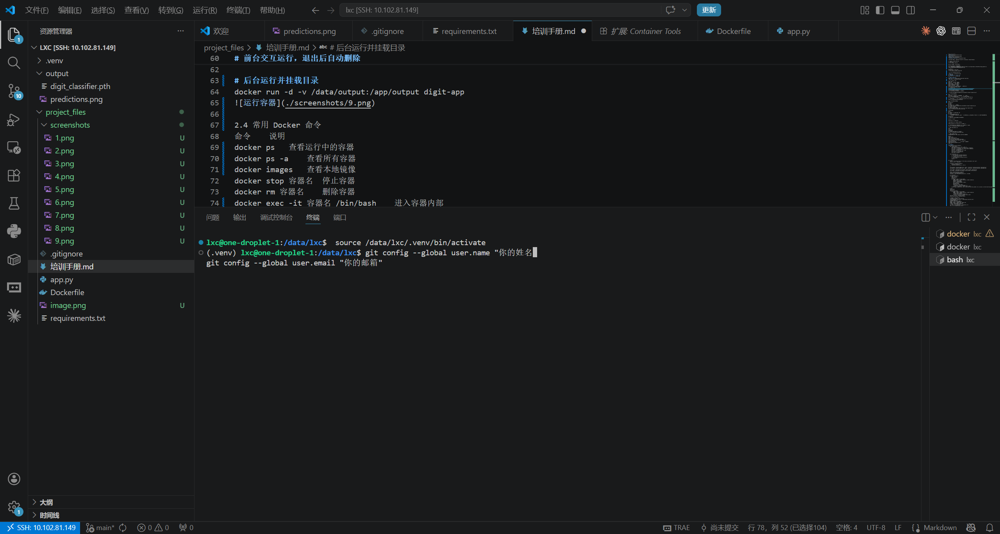

3.2 创建 GitHub 仓库并关联
登录 GitHub，新建仓库（不要勾选 README）

复制仓库的 SSH 地址，如 git@github.com:miyahane-li/digit-recognition.git

3.3 配置 SSH 免密推送
ssh-keygen -t ed25519 -C "你的邮箱"   # 一路回车
cat ~/.ssh/id_ed25519.pub            # 复制输出的公钥
将上面这些输入到vscode的终端内
将公钥添加到 GitHub：Settings → SSH and GPG keys → New SSH key

3.4 初始化本地仓库并推送
cd /data/lxc
git init
git add .
git commit -m "第一次提交"
git remote add origin git@github.com:miyahane-li/digit-recognition.git
git branch -M main
git push -u origin main
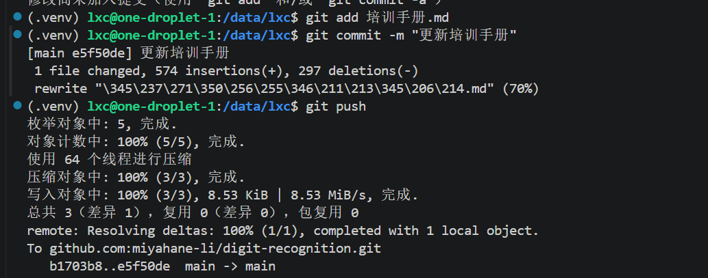（此图的操作并非第一次提交，第一次提交请输入上面的代码，后续提交的方式如图）

3.5 日常更新
bash
git add .
git commit -m "描述修改了什么"
git push
第二部分：手写数字识别实战
在掌握了上面的基本工具后，我们将通过一个完整项目把它们串联起来：用 PyTorch 训练 CNN 识别手写数字。

项目文件结构
在 /data/lxc 目录下，需要创建以下文件：

app.py – 训练脚本

Dockerfile – 镜像构建说明

requirements.txt – Python 依赖清单

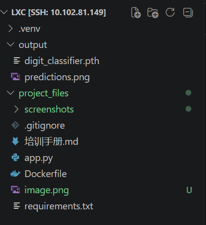

1. 编写 requirements.txt
torch
torchvision
matplotlib
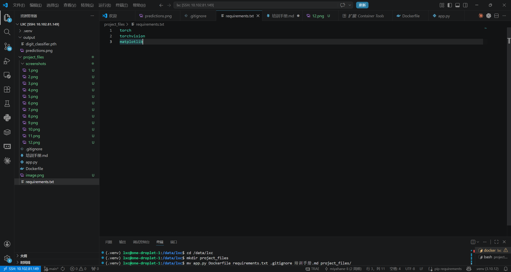

2. 编写训练代码 app.py
代码略，需要编写的话请交给ai助手
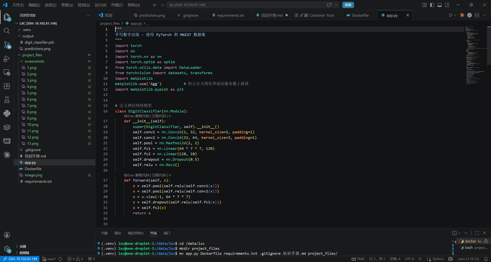

3. 编写 Dockerfile
FROM python:3.10-slim
WORKDIR /app
COPY requirements.txt .
RUN pip install --no-cache-dir -r requirements.txt
COPY app.py .
CMD ["python", "app.py"]
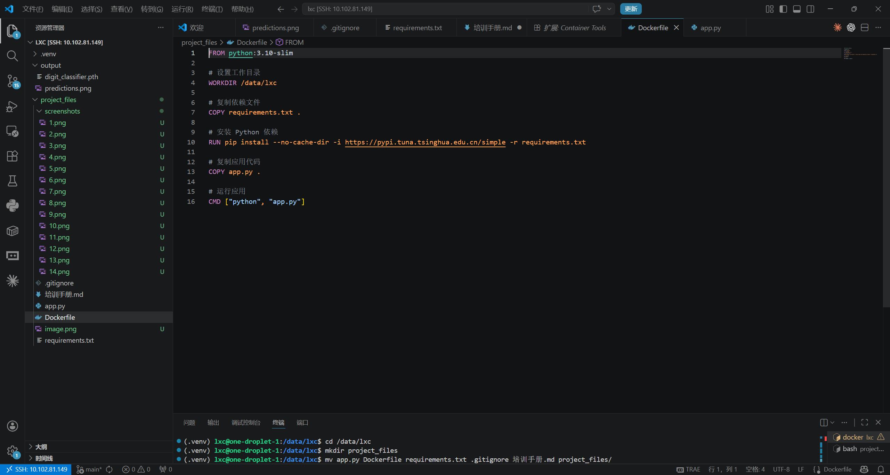

 4. 构建镜像
在终端中执行：

docker build -t digit-app .
构建过程会下载基础镜像并安装 torch、torchvision 等。如果下载很慢，可以使用清华源：（建议直接使用清华源，直接下载极容易因为速度太慢而失败）

RUN pip install --no-cache-dir -i https://pypi.tuna.tsinghua.edu.cn/simple -r requirements.txt
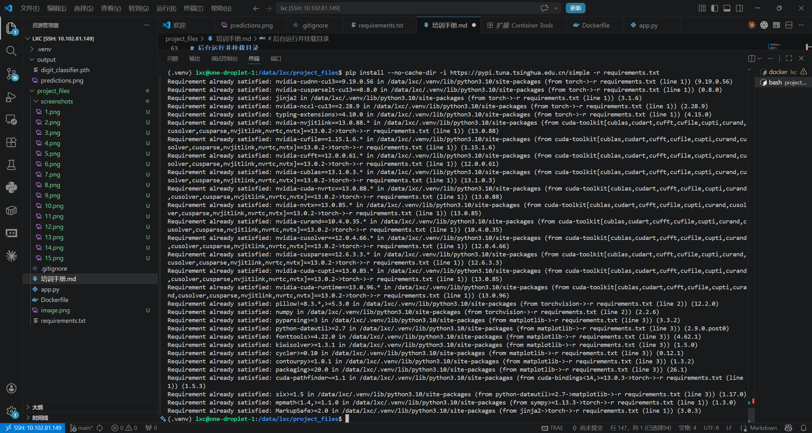

5. 运行训练容器
5.1 前台运行（可查看实时日志）
docker run -it --rm digit-app
容器会自动下载 MNIST 数据集并开始训练，大约需要 2～5 分钟（取决于 CPU）。
你会看到如下关键输出：

下载进度：100.0%

模型结构打印

训练日志：Epoch [1/5], Loss: ..., Accuracy: ...

最终测试准确率：Test Accuracy: 0.9902（示例）

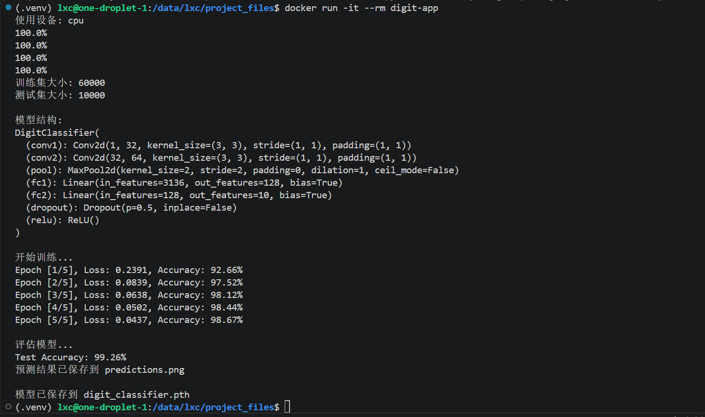

第三部分：常见问题排查
现象	原因	解决方法
docker build 下载慢或超时	PyPI 源缓慢	使用清华源 -i https://pypi.tuna.tsinghua.edu.cn/simple
训练时卡在下载数据集	容器内无法访问外网	检查网络，或提前下载 MNIST 并挂载到 ./data
容器内 import torch 失败	requirements.txt 未包含 torch	补充依赖并重新构建
挂载目录后找不到模型文件	路径映射错误	确认 -v 宿主机绝对路径:容器内路径 正确
预测报错 ModuleNotFoundError: No module named 'PIL'	缺少 Pillow	在 requirements.txt 加入 Pillow，重新构建
git push 提示 Permission denied	未添加 SSH 公钥	按第一部分步骤添加公钥

✨ 至此，你已经完成了从环境搭建到模型训练、再到单张图片预测的全流程。将这份指南与你自己的截图结合，就是一份完美的培训文档。
后续可继续学习《RAG 专项培训手册》，构建更复杂的智能问答系统。